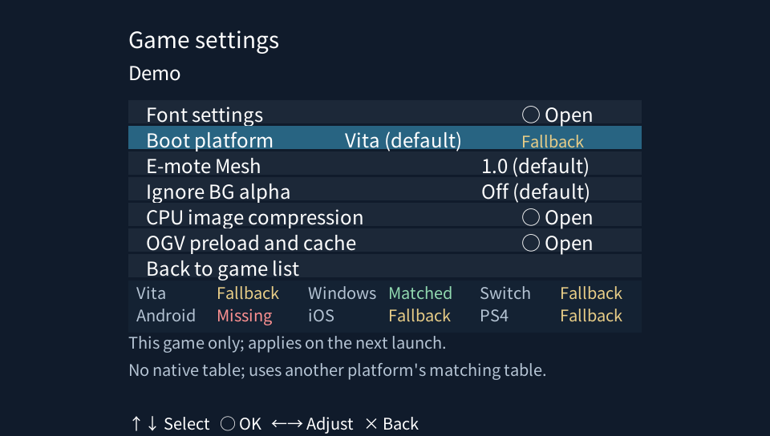
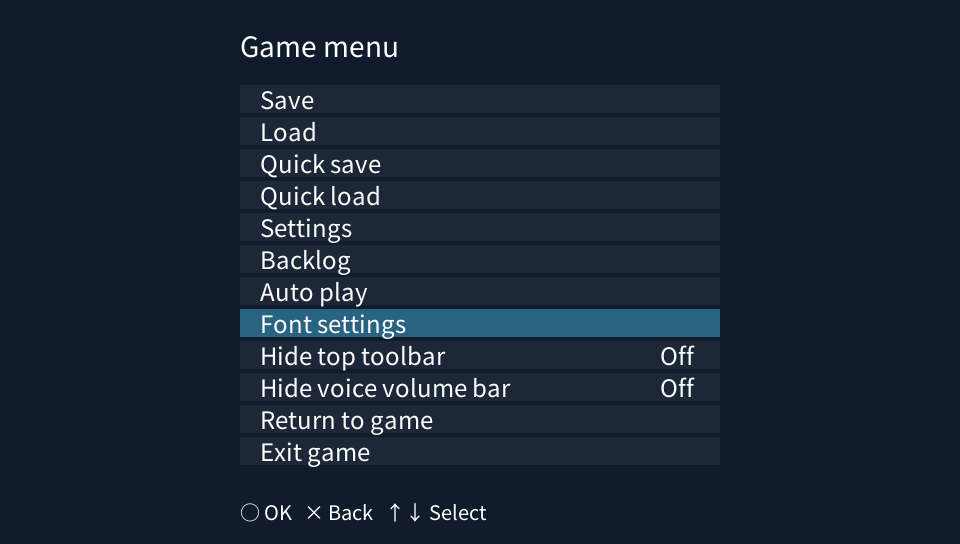
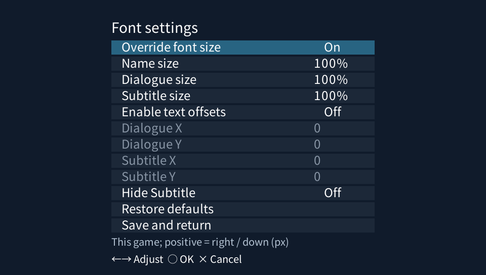
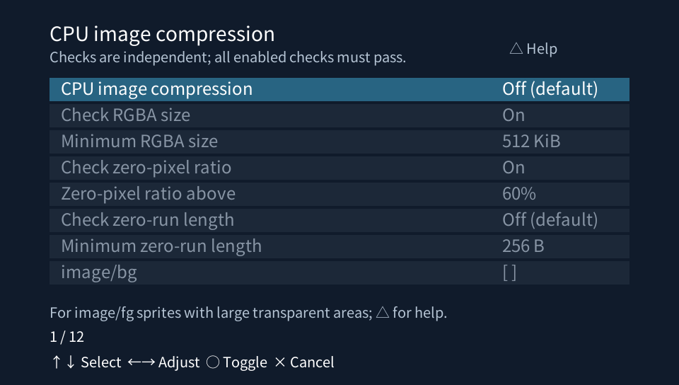
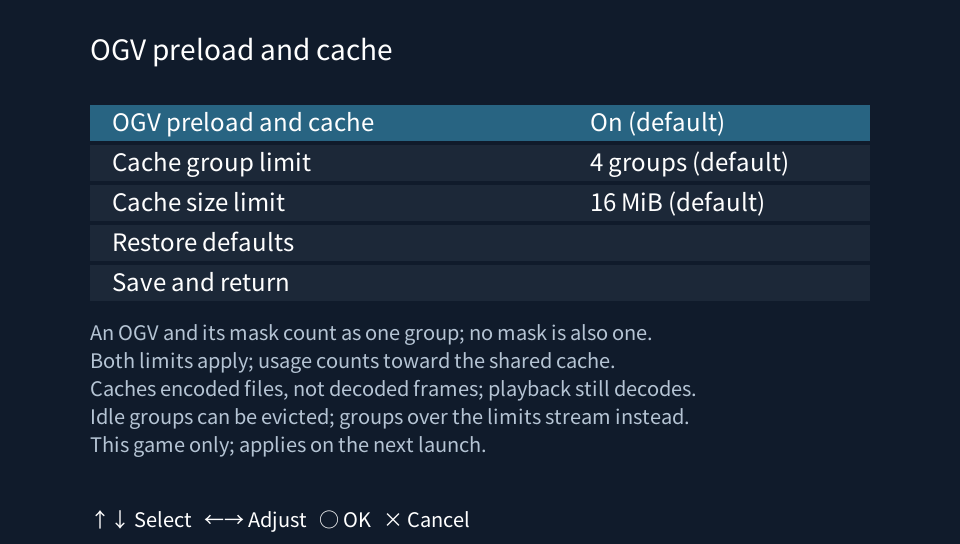
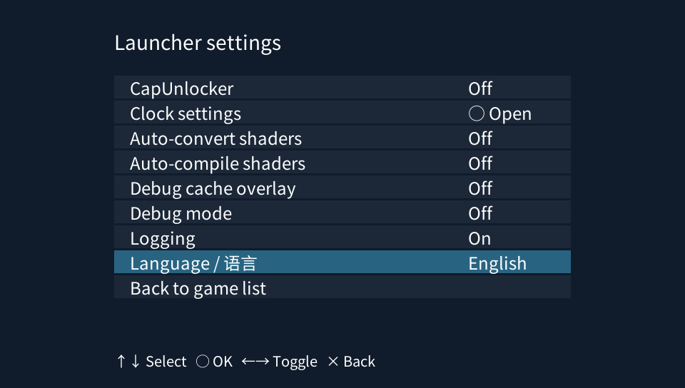
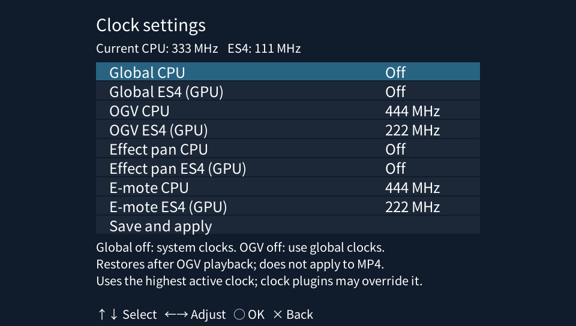

# Art3m1sPSV

[简体中文](readme.md) | [English](README.en.md)

> [!IMPORTANT]
> **First, use the companion tool [Art3m1sPsvPortTool](https://github.com/DeQxJ00/Art3m1sPsvPortTool) to resize and convert image and video assets.** Then place the processed resources in `ux0:/data/art3m1s-gxm/games/`, with one subfolder per game. See [Resource adaptation](#resource-adaptation) below for detailed instructions.

An Artemis game runner for PlayStation Vita, based on the third-party Art3m1s implementation. Parsing and runtime behavior are based on **Alphaly2K/art3m1s-core**, with PSV adaptations for some newer engine script behaviors, rendering, resource caching, audio/video, and input.

The project uses a Rust core and a native **GXM** host. Compatibility with different engine versions, scripts, and resource formats is still being improved; not every game is guaranteed to run.

See the [Changelog](CHANGELOG.en.md) for features, fixes, and performance changes by version.

## Features

- **Bundled original demo**: the complete Starwind Observatory demo (STARWIND_DEMO), with Chinese/Japanese/English selection, Japanese voice acting, separate expression sprites, E-mote, shaders, OGV, saves, loads, and Backlog.
- **Native GXM rendering**: common shaders, masks, transitions, and reusable effect caches.
- **E-mote animated characters**: motion, expressions, lip sync, masks, DXT5 textures, model preloading, parsed-model caching, and adjustable mesh detail.
- **Image caching**: preloading, idle texture reuse, and optional ZeroSpan32 CPU image cache compression.
- **Audio/video**: hardware-decoded MP4 and OGV effect animations. OGV files can be preloaded with their masks, subject to group-count and memory limits.
- **Per-game settings**: boot platform, font sizes, dialogue/subtitle offsets, hiding subtitles, the top toolbar, and the dialogue volume bar.
- **Performance and diagnostics**: separate CPU/ES4 clocks for global use, OGV, effect pans, and E-mote, plus independent debug self-tests, a cache overlay, and logging.

## Installation and use

1. Install the VPK. The bundled Starwind Observatory demo is available directly from the game list.
   Opening the game selection screen triggers one background check per app session for a newer stable GitHub Release with an uploaded VPK. A persistent notice appears only in the top-right corner of the game selection screen. It hides when entering a game and reappears when returning to the game list; installing that version or newer removes it. Offline or failed checks do not interrupt use; nothing is downloaded or installed automatically.
2. Place adapted resources in `ux0:/data/art3m1s-gxm/games/`, with one subfolder per game.
3. Launch the app and select a game.

```text
ux0:/data/art3m1s-gxm/
└─ games/
   ├─ game_01/
   │  ├─ root.pfs       # Example: keep actual archive names and required volumes
   │  ├─ title.txt      # Optional display title
   │  ├─ icon.png       # Optional game-list icon
   │  └─ platform.txt   # Optional boot platform
   └─ game_02/
      └─ …
```

- Game folder names support Chinese, Japanese, spaces, parentheses, and other common symbols, up to 100 UTF-8 bytes. Do not use `/ \ : * ? " < > |`, control characters, or a trailing space or period. Renaming a folder changes its save/settings identity; keep existing game folder names unchanged when possible.
- To display a Chinese title, create `title.txt` in the game folder, encoded as **UTF-8 without BOM**, containing the display title.
- The game list reads `icon.png`, with support for `icon0.png`, `sce_sys/icon0.png`, and `saveicon.png`. A square PNG is recommended; it is scaled proportionally to fit 48 × 48. If no usable icon exists but an `.exe` has the same base name as a `.pfs` archive, the icon is extracted after loading that game starts and cached in `ux0:/data/art3m1s-gxm/icon-cache/`. If no matching EXE exists, it uses another EXE only when exactly one EXE in that folder has an extractable icon. It appears when returning to the game list or on the next launch; multiple usable EXE icons are not chosen automatically. Other games receive title-based icons. PFS files are not modified.
- Preserve relative paths between archives and loose resources. Do not mix an extra set of debugging extracts into the active game folder.
- The default boot platform is **Vita**. Select a game and press **□** to choose Vita, Windows, Switch, Android, iOS, or PS4. This is saved per game and applies on its next launch. Creating `platform.txt` manually is optional.
- Press **SELECT** in the game list, or tap **About** in the upper right, to view the developer, project GitHub address, and credits.

## Resource adaptation

### Images and UI

Identify the original canvas size first; a full background image is usually a useful reference. Common 16:9 scaling ratios are:

| Original size | Scale | Target size |
| --- | --- | --- |
| 1280 × 720 | 0.75 | 960 × 540 |
| 1920 × 1080 | 0.5 | 960 × 540 |

The PSV screen is `960 × 544`. For other aspect ratios, scale according to the actual canvas rather than stretching directly. Character sprites, expressions, UI assets, and their coordinates must use consistent scaling rules.

Use either of these tools:

- **VisualNovelUpscaler**: extract the game first, then resize images and supported companion resources. Process movie files separately using the FFmpeg instructions below.
- **[Art3m1sPsvPortTool](https://github.com/DeQxJ00/Art3m1sPsvPortTool)**: this project's resource adaptation tool supports folder-based conversion, movie transcoding, E-mote PSB scaling, and font subsetting. It also converts movie files to PSV-compatible formats. Its processing broadly follows VisualNovelUpscaler, but it can read PFS archives directly, allowing most conversion work to run after selecting the game folder.

### E-mote animated characters

PSV-side **E-mote rendering** supports models, motion, expressions, lip sync, and mask compositing. PSB preloading, parsed-model caching, and direct upload of **DXT5 (BC3) textures** reduce repeated parsing and texture expansion.

Models still need to be scaled for the target canvas. Use the resource tool above to process PSB files and convert textures to DXT5. Select a game and press **□** to adjust **E-mote Mesh**. The default `1.0` preserves original mesh detail; lower values reduce mesh computation but may alter deformation details.

E-mote scenes request **CPU 444 MHz / ES4 222 MHz** by default. Both clocks can be adjusted separately in the launcher's clock settings. Frame rate for complex models or multiple characters still depends on model complexity, resource dimensions, and actual device clocks.

### Audio and movies

Audio can usually be left unchanged; convert it separately if format or playback problems occur.

The per-game **Audio fade in/out** switch is off by default. When enabled, forced stops and immediate replacements add a short ramp of about 12 ms. Fades requested by game scripts stay unchanged.

Movie files, including some `.dat` and `.wmv` files, should be converted to **MP4 with H.264 video and AAC audio** for the current PSV hardware decoding path. For 16:9 content:

```bash
ffmpeg -i input.dat -map 0:v:0 -map "0:a:0?" -vf "scale=960:540:flags=bicubic" -c:v libx264 -profile:v main -level:v 3.1 -pix_fmt yuv420p -crf 23 -c:a aac -b:a 128k -ar 48000 -movflags +faststart output.mp4
```

Adjust the dimensions for other aspect ratios. After conversion, make sure filenames and paths still match script references; changing the extension alone is not enough.

**OGV effect animations differ from MP4 movies.** OGV currently uses software decoding and GXM color conversion; some effects also have a companion alpha animation. Replacing these with ordinary opaque MP4 files may break compositing. High-resolution or complex OGV content may still run slowly. VisualNovelUpscaler and [Art3m1sPsvPortTool](https://github.com/DeQxJ00/Art3m1sPsvPortTool) can process OGV automatically, without a separate manual conversion step.

## Settings and additional features

On first launch, a bilingual page lets you choose **简体中文 / English**. The choice is saved before entering the game list and reused on subsequent launches. Use **START → Language / 语言** to change it at any time; changes apply immediately and are saved automatically. This covers the launcher, settings, loading messages, About page, and host game menu, without changing the game's dialogue language.

The English menu previews below are rendered from the current menu code, using the application font and pre-baked menu atlas. They show sample settings at the native 960 × 544 resolution.

Select a game and press **□** to open its settings. Font settings, boot platform, E-mote Mesh, background alpha, and cache options are saved per game.



### Game menu and font sizes

Press **□** in-game to open the menu. A usable native game menu takes precedence; otherwise, the host menu provides save/load, Backlog, font settings, and exit actions.

**L + □** opens the host menu directly. **Hide top toolbar** applies immediately and is saved per game; it is off by default and is available only in the in-game menu.

**Hide voice volume bar** independently hides the dialogue volume slider and its touch area. It is off by default, saved per game, and applies immediately. It does not change volume or hide controls on the game's own settings screen. It currently recognizes sliders declared through `btn.adv.p.sl_vol`.



Actions supplied by game scripts are grayed out when the current game does not declare them.

Font settings separately adjust **name**, **Dialogue (primary)**, and **Subtitle (secondary)** text sizes. Enable **Override font size** to apply them. When disabled, the game's settings are used; `100%` means the original size.

You can also enable text offsets for `Dialogue X/Y` and `Subtitle X/Y` separately, or enable **Hide Subtitle**. Offsets and hiding are disabled by default; offsets start at `0` and apply only to the current game. Positive values move text right/down. These roles come from the game's declared primary/secondary text layers, not language detection. Offsets use logical stage pixels and do not change name or Backlog text.



### CPU image cache compression

Open **Game list → □ Game settings → CPU image compression**. It is off by default, saved per game, and applies on the next game launch.

This primarily targets sprites and portraits under `image/fg`. Some assets are stored and drawn as large images with mostly transparent areas instead of small cropped images positioned using PNG metadata. Transparent pixels still consume memory after decoding, so many such images can fill the cache and cause decoding stalls during switches.

Enable the feature and select image folders as needed; selections include subfolders. Eligible decoded pixels use **lossless ZeroSpan32 compression** to reduce CPU cache usage. It does not rewrite PNG files or change the format of PSB, OGV, or GPU-native compressed textures.

| Option | Default | Purpose |
| --- | --- | --- |
| CPU image compression | Off | Master switch; select folders as needed, starting with `image/fg` |
| Check RGBA size | On, at least 512 KiB | Uses width × height × 4 to skip small images |
| Check zero-pixel ratio | On, above 60% | Counts pixels whose four RGBA channels are all zero, not alpha alone |
| Check zero-run length | Off, threshold 256 B | Optional filter for more continuous zero-filled areas |

Checks can be enabled independently; all enabled checks must pass. Ratio and run-length statistics are collected during decoded output, before deciding whether to compress. Small images or images with little transparency usually do not need this feature. Press **△** for help.



### OGV preload and cache

Open **Game list → □ Game settings → OGV preload and cache**. It is on by default, saved per game, and applies on the next game launch.

| Option | Default | Range |
| --- | --- | --- |
| Cache group limit | 4 groups | 1–16 groups |
| Cache size limit | 16 MiB | 4–64 MiB, in 4 MiB steps |

A color OGV and its mask count as **one group**, with their combined size used for accounting. An OGV without a mask also counts as one group. Both limits apply, and usage counts toward the shared cache budget. Recognizable upcoming script references are preloaded in the background. Cache hits reuse source data; idle groups can be evicted under memory pressure, active groups are protected, and groups over the limits continue streaming.

**The cache stores compressed file data, not all decoded frames.** It reduces repeated reads and some switching delays, but playback still requires decoding and is not guaranteed to reach full frame rate.



### Ignore background alpha

Open **Game list → □ Game settings → Ignore BG alpha**. It is off by default. Enabling it treats backgrounds as opaque, which may reduce compositing cost but can break images that need transparency or layered compositing. Normally leave it off; use it only after confirming that the resources are suitable.

### Launcher settings and plugins

Press **START** in the game list to configure CapUnlocker, clocks, shader options, Debug mode, the debug cache overlay, logging, and language.



| Feature | Component | Notes |
| --- | --- | --- |
| Fourth CPU core | CapUnlocker | Allows background tasks to use core 4; the plugin must be installed and enabled. Restart the app after changing the option |
| On-device shader compilation | `vitaShaRK` | Used to compile external Cg on PSV; built-in effects do not need runtime compilation |

**Global overclocking is off by default.** OGV and E-mote scenes request **CPU 444 MHz / ES4 222 MHz** by default. CPU/ES4 clocks are independently configurable for global use, OGV, effect pans, and E-mote. When a scene ends and no other clock override remains active, the clocks from before the app took control are restored. A configured value does not guarantee that the device accepted it; check the log or performance overlay.



**Debug mode** is off by default; an existing saved enabled state is retained. When on, it runs and displays startup shader self-tests. Restart to apply changes. **When off, startup self-tests are skipped**, while normal rendering and cache optimizations remain active; the app no longer runs hidden tests behind a black screen.

**Logging** is on by default and writes to `ux0:/data/art3m1s-gxm/host.log`. Turning it off and restarting stops log creation and rotation. Re-enabling also requires a restart. Logging does not control the debug cache overlay or in-game Backlog.

### Debug cache overlay

The right-side **Debug cache overlay** is off by default and independent of Debug mode and logging. It refreshes every **0.5 seconds** and reports sizes in **MiB**. E-mote and OGV sections appear when relevant cache or activity records exist.

| Field | Meaning |
| --- | --- |
| `TOTAL` | Shared image, E-mote, and OGV cache usage / budget; not total application memory |
| `READY`, `PIX / ZIP` | Image preload cache total and decoded / source-file data; ZeroSpan32 counts on the decoded-data side |
| `LUA LOAD`, `LUA PIX / ZIP` | Completed / planned script preloads and currently ready decoded / source-file resource counts |
| `IDLE`, `CPU / GPU`, `IDLE ZIP` | Idle cache and its CPU data, GPU textures, and source-file data |
| `HIT GPU`, `CPU / ZIP`, `MISS / EVICT` | Image cache hits by tier, misses, and evictions |
| `MODEL ALL`, `PSB`, `PARSED` | E-mote model cache usage, counts, preload progress, and source / parsed-data hits |
| `OGV`, `OGV GROUP` | OGV size / limit and group count / limit; video and mask count as one group |
| `READY / LOAD`, `HIT / MISS` under OGV | Ready / pending groups and OGV source-cache hits / misses, separate from image statistics |

### Shaders

Common effects such as grayscale, mosaic, blur, and transitions are built in. Supported effects work directly. **Automatic shader conversion and compilation are both off by default** and usually do not need to be enabled.

Built-in game effect sources are in `shaders/psv/`. Each `name.cg` has a corresponding compiled `name.hlsl.agxp`. The game still reads original HLSL resources, and built-in programs are matched by **source content**, not filename alone. The original 51 source files were consolidated into 31 effects, with three additional source variants, for 34 built-in matches.

| Built-in file | Effect |
| --- | --- |
| `reset.cg` | Copy without color effects |
| `gray.cg` | Grayscale |
| `nega.cg` | Color inversion |
| `sepia.cg`, `sepia2.cg` | Sepia and its variant |
| `rgb.cg` | Separate red, green, and blue channel adjustment |
| `cadd.cg`, `cmul.cg` | Color-channel addition and multiplication |
| `add.cg`, `mul.cg`, `screen.cg` | Two-texture additive, multiply, and screen blending |
| `compbr.cg`, `compbrc.cg` | Lighten blending and its variant |
| `compdk.cg`, `compdkc.cg` | Darken blending and its variant |
| `blend.cg`, `blend2.cg` | Generate alpha from luminance; the latter uses a threshold rule |
| `blur_h.cg`, `blur_v.cg` | Horizontal and vertical Gaussian blur |
| `blur_k.cg`, `blur_kx.cg`, `blur_ky.cg` | Diagonal bidirectional, horizontal, and vertical Kawase blur |
| `radial.cg` and its compatibility variant | Two source versions of radial blur |
| `mosaic.cg` | Mosaic pixelation |
| `noise.cg` | Noise displacement |
| `raster.cg` | Wave displacement |
| `dimhole.cg`, `dimover.cg`, `dimring.cg` | Circular cutout/distortion, circular darkening, and ring highlighting |
| `trapezoid_up.cg`, `trapezoid_dw.cg`, `trapezoid_lt.cg`, `trapezoid_rt.cg` | Upward, downward, leftward, and rightward trapezoid transforms |

- **Auto-convert** translates the supported HLSL subset into PSV Cg; it does not support arbitrary HLSL.
- **Auto-compile** compiles Cg to GXP on PSV and requires `ur0:/data/libshacccg.suprx`.
- External effects require matching original shader sources, companion parameters, and cache validation data. **Dropping in an arbitrary `.cg` or `.gxp` is not sufficient.**
- Caches retain the source shader's relative directory structure. Sources under `system/shader/pc/` may still use a corresponding `pc/` cache path; selecting Vita does not require manually renaming it.

See [Shader placement instructions (Chinese)](host-direct/SHADER_PLACEMENT.zh-CN.md) for layouts and option combinations. The VPK includes the original Starwind Observatory PFS demo; other generated test resources remain in local temporary directories.

## Controls

| Button | Action |
| --- | --- |
| D-pad ↑ | Backlog |
| D-pad ↓ | Continue |
| D-pad ← | Quick save |
| D-pad → | Quick load |
| SELECT | Auto play |
| □ Square | Game menu |
| ○ Circle | Next page / confirm |
| × Cross | Cancel |
| △ Triangle | Backlog |
| L + START | Mouse right-click; behavior depends on the game |

## Known limitations and reports

- Some scene switches, resource loads, and complex effects still cause stalls; optimization is ongoing.
- Engine versions and custom scripts may differ in compatibility.
- Vita3K and real hardware have different performance characteristics. Use hardware measurements for frame-rate reports.

When reporting a problem, include:

1. The full VPK version or corresponding commit.
2. Hardware or emulator, CPU/ES4 clocks, and relevant plugins.
3. Whether resources were resized, original/output dimensions, and whether videos were transcoded.
4. Reproduction steps, a reproducible save slot, and screenshot or recording timestamps.
5. `ux0:/data/art3m1s-gxm/host.log` from that run; copy it before restarting the app.

## Building

### GitHub Actions

VPK builds run on pushes to `main`, pushes of `v*` / `beta*` tags, and pull requests targeting `main`. You can also trigger **Actions → Build VPK → Run workflow** manually.

After a build, download `Art3m1sPSV-VPK-version-run-number` from that run's **Artifacts**. It contains a versioned VPK, version metadata, and `SHA256SUMS`, and is retained for 30 days. The artifact and VPK use the same version; development builds also include the commit identifier. Build logs are retained for seven days. The build workflow uses pinned core, VitaSDK, and Rust nightly versions and does not itself publish a Release or increment the version.

Linux can use the same build entry point, with `build-essential`, CMake, Python 3, curl, Git, bzip2, and rustup installed:

```sh
git submodule update --init --recursive
export VITASDK="$PWD/build/vitasdk"
bash scripts/ci/install-vitasdk.sh
rustup toolchain install nightly-2026-08-28 --profile minimal --component rust-src
bash scripts/build-linux.sh
```

### Local Windows build

The current workflow uses **Windows PowerShell + WSL Ubuntu 24.04** and requires VitaSDK, a Rust nightly toolchain with the Vita target, CMake, and media dependencies. Recompiling shader sources also requires the appropriate compiler tools.

**Build scripts currently contain local toolchain paths and will not run unmodified after cloning.** Check VitaSDK/Rust paths in `scripts/build-native-commands-core.ps1` and the WSL VitaSDK path in `scripts/build-native-commands-host.sh`. Prepare dependencies such as `build/media-sdk/` and `build/tremor/`.

Initialize the pinned core submodule, including after updating the main project:

```sh
git submodule update --init --recursive
```

Build the complete package:

```powershell
powershell -NoProfile -ExecutionPolicy Bypass -File scripts/build.ps1
```

A successful build creates a separate VPK and JSON verification manifest under `build/releases/`; `latest.json` identifies the latest output. Versions follow the nearest official `vMAJOR.MINOR.PATCH` tag on the current branch. Commits after a tag are marked as development builds. Building does not increment versions or create tags.

Run core regression tests:

```powershell
powershell -NoProfile -ExecutionPolicy Bypass -File scripts/check-direct-effects-core.ps1
```

Test build caches are stored under `build/`; run logs and summaries go to `temp/test-results/core/`. You can remove `temp/` after stopping related tasks. Do not store backups, unique original resources, or production source files there.

## Credits

Thanks to the following open-source projects:

- [Art3m1s](https://github.com/Alphaly2K/art3m1s) and [art3m1s-core](https://github.com/Alphaly2K/art3m1s-core): upstream host and engine core.
- App icon: adapted and resized from the [original Alphaly2K/art3m1s logo](https://github.com/Alphaly2K/art3m1s/blob/main/assets/branding/art3m1s-logo-v1.png) for the PSV bubble icon.
- [VitaSDK](https://github.com/vitasdk): PS Vita toolchain and platform libraries.
- [vitaShaRK](https://github.com/Rinnegatamante/vitaShaRK): runtime shader compilation wrapper for PS Vita.
- [FFmpeg](https://ffmpeg.org/): audio/video demuxing, decoding, and conversion.
- [Tremor](https://xiph.org/tremor/): fixed-point Ogg Vorbis decoding.
- [Lua](https://www.lua.org/) and [mlua](https://github.com/mlua-rs/mlua): scripting runtime and Rust bindings.
- [asb-decrypt](https://github.com/Alphaly2K/asb-decrypt): ASB script decryption.
- [pfs-rs](https://github.com/sakarie9/pfs-rs): foundation for PFS archive handling.
- [image](https://github.com/image-rs/image): image decoding and processing.
- [ab_glyph](https://github.com/alexheretic/ab-glyph): font glyph parsing and rasterization.
- [stb](https://github.com/nothings/stb): host image and font utilities.
- [cJSON](https://github.com/DaveGamble/cJSON): JSON parsing.
- [curl](https://curl.se/) / [Mbed TLS](https://www.trustedfirmware.org/projects/mbed-tls/): HTTPS and TLS for background update checks; the [Mozilla CA bundle](https://curl.se/docs/caextract.html) provides certificate verification.
- [VOICEVOX:ナースロボ＿タイプＴ](https://voicevox.hiroshiba.jp/product/nurserobo_typet/): synthesized Japanese voices in the bundled demo.
- [VitaCompanion](https://github.com/devnoname120/vitacompanion) and [Vita3K](https://github.com/Vita3K/Vita3K): hardware deployment, debugging, and emulator testing.

Thanks also to their authors, maintainers, and contributors. See [core/LICENSE](https://github.com/DeQxJ00/art3m1s-core-psv/blob/codex/psv/LICENSE) for the core license. Third-party licenses remain in their respective directories.
