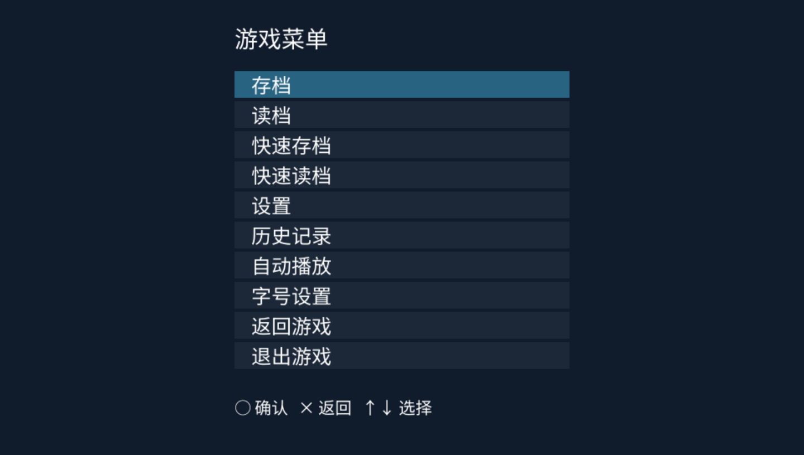
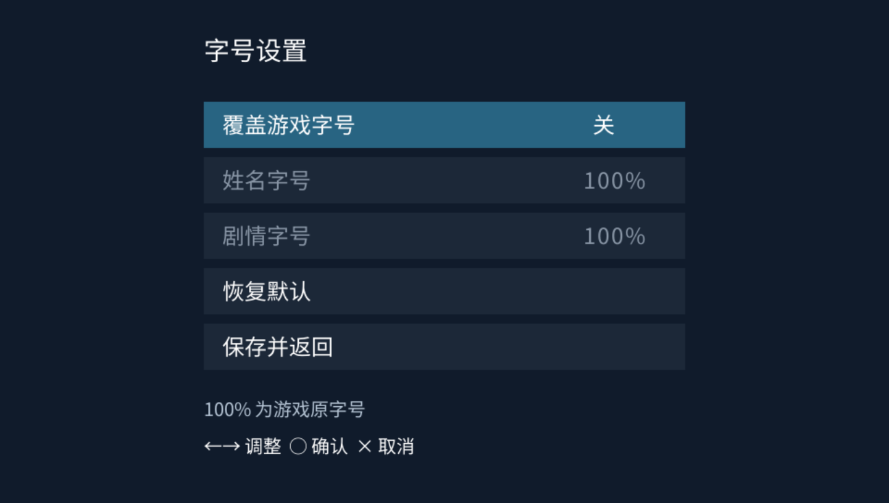

# Art3m1sPSV

面向 PlayStation Vita 的 Artemis 游戏运行器，基于第三方实现 Art3m1s 开发。解析与运行时以 **Alphaly2K/art3m1s-core** 为基础，为 PSV 补充了部分较新引擎的脚本行为，并调整了渲染、资源缓存、音视频和输入处理。

当前使用 Rust 核心与原生 **GXM** 宿主，处于 **dev 测试阶段**。不同引擎版本、脚本和资源格式的兼容性仍在完善，不能保证所有游戏都能正常运行。

**请先缩减图片和视频资源，再进行实机测试。** 原始高分辨率资源即使能够进入游戏，后续也可能出现内存不足、卡顿或画面异常。反馈性能问题前，请先完成下文的资源适配。

## 安装与使用

1. 安装 VPK。
2. 将处理好的资源放进 `ux0:/data/art3m1s-gxm/games/`，一个子文件夹对应一个游戏。
3. 启动程序，在游戏选择界面进入对应项目。

```text
ux0:/data/art3m1s-gxm/
└─ games/
   ├─ game_01/
   │  ├─ root.pfs       # 示例：保留实际资源包名称及必要分卷
   │  ├─ title.txt      # 可选：显示标题
   │  └─ platform.txt   # 可选：平台入口
   └─ game_02/
      └─ …
```

- 游戏文件夹名称使用英文字母、数字、下划线 `_` 或连字符 `-`，不要使用中文、空格或其他符号。
- 如需显示中文标题，在该游戏目录中新建 `title.txt`，使用 **UTF-8 无 BOM** 编码，写入显示标题。
- 保持资源包及解包资源的相对路径关系；不要把调试时解出的第二套资源混进正在运行的游戏目录。
- 平台入口默认使用 **Vita**；可以在游戏选择界面选中游戏，按 **□** 打开该游戏的设置，切换 Vita／Windows 入口。`platform.txt` 可选，无需手工创建才能运行。

## 资源适配

### 图片与界面

先确认原始画布尺寸，通常可以参考完整背景图的尺寸。常见 16:9 资源的缩放比例为：

| 原始尺寸 | 缩放比例 | 目标尺寸 |
| --- | --- | --- |
| 1280 × 720 | 0.75 | 960 × 540 |
| 1920 × 1080 | 0.5 | 960 × 540 |

PSV 屏幕为 `960 × 544`。非 16:9 资源应按实际画布处理，避免直接拉伸；立绘、表情、UI 和相关坐标也需要按同一套规则缩放。

**保留资源本来的透明度。** 立绘、表情和遮罩不能统一去掉 alpha，也不要给原本不透明的背景错误地增加半透明像素。只缩小文件体积而不调整尺寸，并不能解决解码后纹理过大的问题。

可使用以下资源处理工具：

- **VisualNovelUpscaler**：先解出游戏内容，再缩放图片和支持的配套资源；电影文件单独处理。
- **art3m1s_psv_port_tool**：本项目作者提供的资源适配工具，支持按文件夹转换，并提供电影转码、E-Mote PSB 缩放和字体子集化功能。工具能够处理某类资源，不代表运行器已经完整支持该功能。

字体子集化时应包含正文、姓名、菜单等需要的字符，否则会导致缺字。原始资源请另行保留，处理完成后再复制到设备。

### 音频与电影

音频通常可先保留原样；遇到格式或播放问题时再单独处理。

电影类文件，例如部分 `.dat`、`.wmv` 视频，建议转为 **H.264 视频＋AAC 音频的 MP4**，供当前 PSV 硬解路径使用。对于 16:9 素材，可以参考：

```bash
ffmpeg -i input.dat -map 0:v:0 -map "0:a:0?" -vf "scale=960:540:flags=bicubic" -c:v libx264 -profile:v main -level:v 3.1 -pix_fmt yuv420p -crf 23 -c:a aac -b:a 128k -ar 48000 -movflags +faststart output.mp4
```

这条命令按 16:9 素材缩放；其他比例需要调整尺寸。转换后还应确认文件名、路径与脚本调用匹配，不能只改扩展名。

**OGV 特效动画与 MP4 电影不同。** OGV 当前走软件解码，并使用 GXM 进行颜色处理；部分效果还有配套的透明度动画。不要把它们直接替换成普通不透明 MP4，否则可能破坏合成效果。高分辨率或复杂 OGV 仍可能低帧。

## 设置与附加功能

### 游戏菜单与字号

游戏内按 **□** 呼出菜单：有可用原生菜单时使用游戏菜单，否则提供宿主菜单，可进行存读档、查看历史记录、调整字号及退出当前游戏。



字号设置可分别调整**姓名**与**剧情正文**。打开“覆盖游戏字号”后生效；关闭时沿用游戏自身设置，`100%` 表示游戏原字号。



### 启动器设置与插件

游戏选择界面按 **START** 打开启动器设置，可调整 CapUnlocker、超频、Shader 开关和缓存浮窗。

| 功能 | 需要的组件 | 说明 |
| --- | --- | --- |
| 第四个 CPU 核心 | CapUnlocker | 允许后台任务使用第四核心；插件须已安装并启用，菜单开关修改后重启应用生效 |
| CPU 444 MHz | kubridge | 在超频菜单中选择；实际频率还受设备上其他频率插件的设置影响 |
| PSV 端 Shader 编译 | `libshacccg.suprx` | 需要在设备上编译外置 Cg 时使用；仅运行内置效果不需要实时编译 |

当前默认**全局超频关闭**，OGV 动画期间请求 **CPU 444 MHz／ES4 222 MHz**。可以分别修改全局与 OGV 设置；当 OGV 结束且没有全局频率覆盖时，恢复程序接管前的频率。设置值不代表设备一定已成功切换，可结合日志或性能浮窗确认。

右侧**缓存浮窗**默认关闭，开启后显示缓存占用与命中情况，方便观察场景切入和资源加载。

### Shader

程序已内置多种常用效果，包括灰度、马赛克、模糊及转场等。已覆盖的效果可直接使用，**Shader 自动转换、自动编译默认均关闭**，一般无需开启。

- **自动转换**：将支持的 HLSL 子集转换成 PSV 使用的 Cg，并非任意 HLSL 都能转换。
- **自动编译**：在 PSV 上将 Cg 编译成 GXP，需要 `ur0:/data/libshacccg.suprx`。
- 外置效果需要原始 Shader 与配套参数、缓存校验信息匹配。**不是单独放入一个任意 `.cg` 或 `.gxp` 就能使用。**
- 缓存保留原始 Shader 的相对目录结构；来源在 `system/shader/pc/`，缓存仍可以位于对应的 `pc/` 路径，不必因为选择 Vita 入口而手工改名。

具体文件结构与开关组合见仓库内的 [Shader 放置说明](host-direct/assets/TEST_SHADERS_51/SHADER_PLACEMENT.txt)。VPK 内置了“内置 Shader 演示 demo”和“外置 Shader 演示 demo”，可从游戏选择界面进入验证。

## 按键

以下为通常的剧情操作；游戏原生界面和选项可能接管部分输入。

| 按键 | 功能 |
| --- | --- |
| ○ | 确认／推进；支持文字补全的停句流程中，先补全逐字显示，再进入下一句 |
| × | 取消／返回；剧情中的隐藏文字框行为取决于游戏 |
| △ 或方向键 ↑ | Backlog／历史记录 |
| 方向键 ↓ | 继续下一句 |
| 方向键 ← | Quick Save／快速存档 |
| 方向键 → | Quick Load／快速读档 |
| SELECT | 自动播放 |
| □ | 游戏内菜单；在游戏选择界面打开选中游戏的设置 |
| START | 在游戏选择界面打开启动器设置 |

## 已知限制与反馈

- E-Mote 尚未完成 PSV 端的完整支持。
- 部分场景切换、资源加载和复杂特效仍有卡顿，持续优化中。
- 不同引擎版本及自定义脚本可能存在兼容性差异。
- Vita3K 与实机的性能表现不同，帧率问题以实机测试为准。

反馈问题时请提供：

1. VPK 的完整版本或对应提交。
2. 实机或模拟器、使用的 CPU／ES4 频率及相关插件。
3. 资源是否缩放、原始与处理后的尺寸，以及视频是否转码。
4. 复现步骤、可复现的存档位置，以及截图或录像中的时间点。
5. 本次运行的 `ux0:/data/art3m1s-gxm/host.log`，请在重新启动程序前复制保存。

## 构建

当前构建流程使用 **Windows PowerShell＋WSL Ubuntu 24.04**，需要 VitaSDK、支持 Vita 目标的 Rust nightly、CMake 和媒体依赖。Shader 源码重新编译还需要相应编译工具。

**构建脚本目前保留了本地工具链路径，并不是下载仓库后即可直接运行。** 请先检查 `scripts/build-native-commands-core.ps1` 中的 VitaSDK／Rust 路径，以及 `scripts/build-native-commands-host.sh` 中的 WSL VitaSDK 路径，并准备 `build/media-sdk/`、`build/tremor/` 等依赖。

先初始化固定版本的核心子模块（更新主项目后也执行一次）：

```sh
git submodule update --init --recursive
```

完整构建入口：

```powershell
powershell -NoProfile -ExecutionPolicy Bypass -File scripts/build.ps1
```

成功后在 `build/releases/` 生成独立 VPK 与 JSON 校验清单，`latest.json` 指向本次产物。版本跟随当前分支最近的正式 `vMAJOR.MINOR.PATCH` tag；标签后的提交会标记为开发包，构建不会自动增加版本号或创建 tag。

核心回归测试入口：

```powershell
powershell -NoProfile -ExecutionPolicy Bypass -File scripts/check-direct-effects-core.ps1
```

测试编译缓存保存在 `build/`，运行日志和汇总保存在 `temp/test-results/core/`。停止相关任务后可删除 `temp/`；备份、唯一资源原件和正式源码不要放进去。

## Credits

感谢以下开源项目。

- [Art3m1s](https://github.com/Alphaly2K/art3m1s) 与 [art3m1s-core](https://github.com/Alphaly2K/art3m1s-core)：本项目的上游宿主与引擎核心。
- [VitaSDK](https://github.com/vitasdk)：PS Vita 开发工具链及平台库。
- [vitaShaRK](https://github.com/Rinnegatamante/vitaShaRK)：PS Vita 运行时 Shader 编译封装。
- [FFmpeg](https://ffmpeg.org/)：音视频解封装、解码及格式转换。
- [Tremor](https://xiph.org/tremor/)：定点 Ogg Vorbis 音频解码。
- [Lua](https://www.lua.org/) 与 [mlua](https://github.com/mlua-rs/mlua)：脚本运行时及 Rust 绑定。
- [asb-decrypt](https://github.com/Alphaly2K/asb-decrypt)：ASB 脚本解密支持。
- [pfs-rs](https://github.com/sakarie9/pfs-rs)：PFS 资源归档处理的基础实现。
- [image](https://github.com/image-rs/image)：图像解码与处理。
- [ab_glyph](https://github.com/alexheretic/ab-glyph)：字体字形解析与光栅化。
- [stb](https://github.com/nothings/stb)：宿主使用的图像及字体工具。
- [cJSON](https://github.com/DaveGamble/cJSON)：JSON 解析。
- [VitaCompanion](https://github.com/devnoname120/vitacompanion) 与 [Vita3K](https://github.com/Vita3K/Vita3K)：实机部署、调试及模拟器测试。

也感谢这些项目的作者、维护者和贡献者。核心沿用的许可证见 [core/LICENSE](core/LICENSE)，第三方组件的许可证保留在各自目录中。
