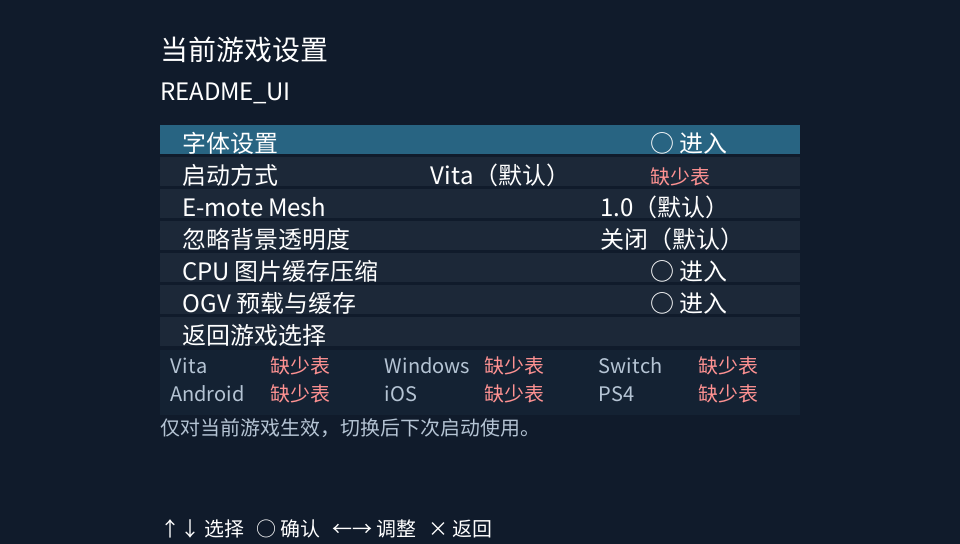
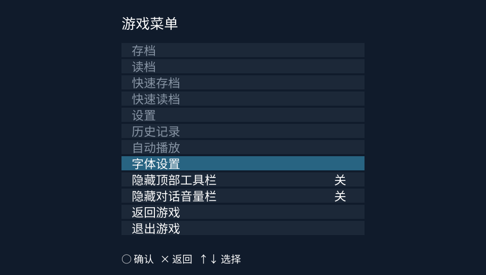
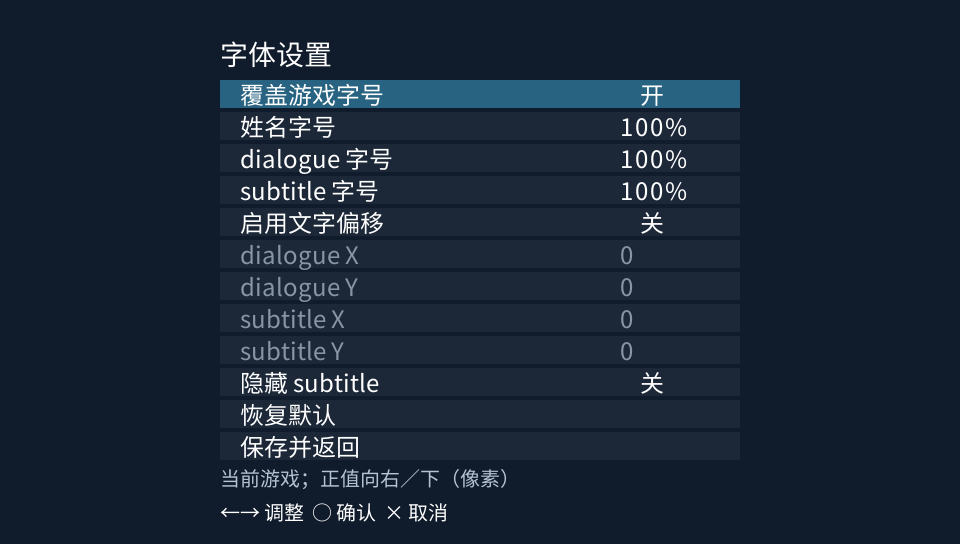
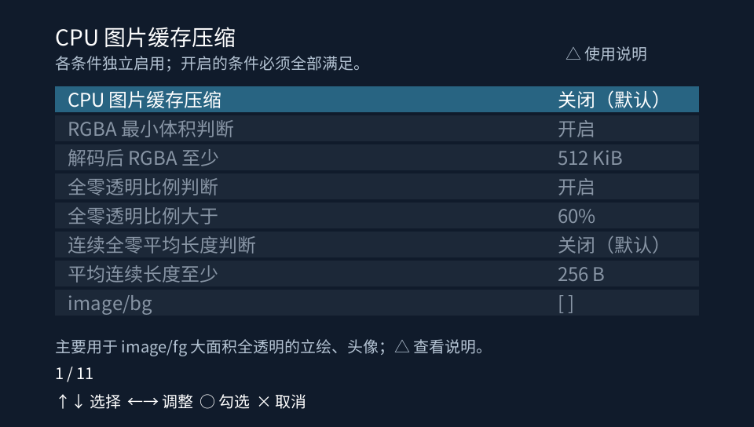
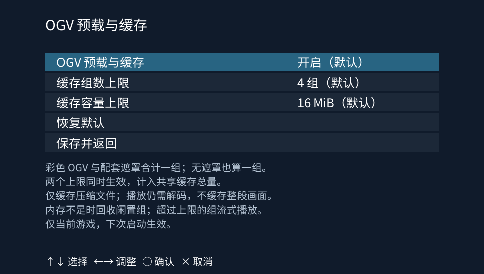
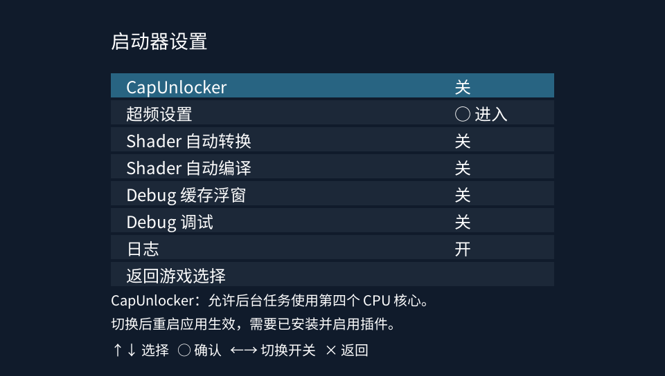
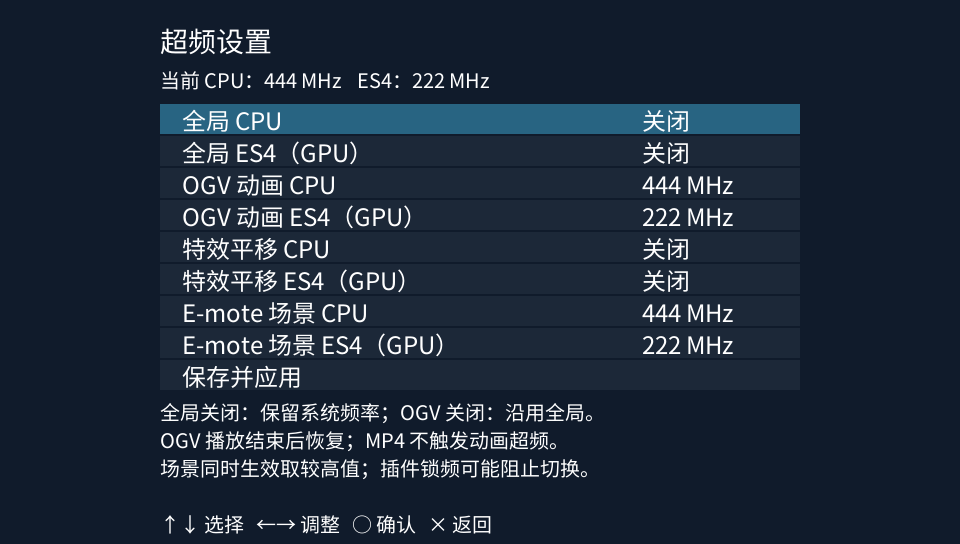

# Art3m1sPSV

[简体中文](readme.md) | [English](README.en.md)

面向 PlayStation Vita 的 Artemis 游戏运行器，基于第三方实现 Art3m1s 开发。解析与运行时以 **Alphaly2K/art3m1s-core** 为基础，为 PSV 补充了部分较新引擎的脚本行为，并调整了渲染、资源缓存、音视频和输入处理。

当前使用 Rust 核心与原生 **GXM** 宿主。不同引擎版本、脚本和资源格式的兼容性仍在完善，不能保证所有游戏都能正常运行。

各版本的功能、修复和性能改动见 [更新日志（CHANGELOG）](CHANGELOG.md)。

## 功能概览

- **内置原创 Demo**：星风观测站完整演示与独立 E-mote 演示，支持中文／日文／英文开篇选择、日语配音、差分表情、Shader、OGV、存读档与 Backlog。
- **原生 GXM 渲染**：支持常用 Shader、遮罩、转场及可复用特效缓存。
- **E-mote 动态立绘**：支持动作、表情、嘴型、遮罩和 DXT5 纹理，提供模型预载、预解析缓存及网格精度设置。
- **图片缓存**：支持预载、闲置纹理复用，以及可选的 ZeroSpan32 CPU 图片缓存压缩。
- **音视频**：支持 MP4 硬解与 OGV 特效动画；OGV 可连同配套遮罩预载，按组数和容量限制缓存。
- **按游戏设置**：支持平台入口、独立字号、Dialogue／Subtitle 偏移、隐藏 Subtitle、工具栏与对话音量栏等选项。
- **性能与诊断**：可分别设置全局、OGV、特效平移和 E-mote 的 CPU／ES4 频率，提供独立的 Debug 自检、缓存浮窗与日志开关。

**请先缩减图片和视频资源，再进行实机测试。** 原始高分辨率资源即使能够进入游戏，后续也可能出现内存不足、卡顿或画面异常。反馈性能问题前，请先完成下文的资源适配。

## 安装与使用

1. 安装 VPK，可直接在游戏列表进入内置的两个“星风观测站”Demo。
2. 将处理好的资源放进 `ux0:/data/art3m1s-gxm/games/`，一个子文件夹对应一个游戏。
3. 启动程序，在游戏选择界面进入对应项目。

```text
ux0:/data/art3m1s-gxm/
└─ games/
   ├─ game_01/
   │  ├─ root.pfs       # 示例：保留实际资源包名称及必要分卷
   │  ├─ title.txt      # 可选：显示标题
   │  ├─ icon.png       # 可选：游戏选择界面的图标
   │  └─ platform.txt   # 可选：平台入口
   └─ game_02/
      └─ …
```

- 游戏文件夹名称支持中文、日文、空格和括号等常见符号，最多 100 个 UTF-8 字节（纯中文通常最多 33 字）。不可包含 `/ \ : * ? " < > |` 或控制字符，也不能以空格或句点结尾。改名会改变存档及独立设置的对应目录，已有游戏建议保持目录名不变。
- 如需显示中文标题，在该游戏目录中新建 `title.txt`，使用 **UTF-8 无 BOM** 编码，写入显示标题。
- 游戏选择界面可读取游戏目录中的 `icon.png`（也兼容 `icon0.png`、`sce_sys/icon0.png`、`saveicon.png`）。建议准备方形 PNG；图片会按比例缩放到 48 × 48。若没有可用图标，但游戏目录里有与 `.pfs` 同名的 `.exe`，第一次进入该游戏、开始加载后会从 EXE 提取图标，缓存在 `ux0:/data/art3m1s-gxm/icon-cache/`；若不存在同名 EXE，则在目录内恰好只有一个 EXE 能提取出图标时使用它。返回选择界面或下次启动时显示；多个 EXE 都有可用图标时不自动选择。其余游戏按标题生成图标。此过程不修改 PFS。
- 保持资源包及解包资源的相对路径关系；不要把调试时解出的第二套资源混进正在运行的游戏目录。
- 启动方式默认使用 **Vita**；可以在游戏选择界面选中游戏，按 **□** 打开该游戏的设置，切换 Vita／Windows／Switch／Android／iOS／PS4 入口。设置按游戏保存，下次启动生效。`platform.txt` 可选，无需手工创建才能运行。
- 游戏选择界面按 **SELECT** 或点击右上角“关于”，可查看开发者、项目 GitHub 地址和 Credits。

## 资源适配

### 图片与界面

先确认原始画布尺寸，通常可以参考完整背景图的尺寸。常见 16:9 资源的缩放比例为：

| 原始尺寸 | 缩放比例 | 目标尺寸 |
| --- | --- | --- |
| 1280 × 720 | 0.75 | 960 × 540 |
| 1920 × 1080 | 0.5 | 960 × 540 |

PSV 屏幕为 `960 × 544`。非 16:9 资源应按实际画布再按对应ratio处理，避免直接拉伸；立绘、表情、UI 和相关坐标也需要按同一套规则缩放。

可使用以下 自动化处理工具 二选一即可：

- **VisualNovelUpscaler**：先解出游戏内容，再缩放图片和支持的配套资源；movie下视频类文件单独处理，看下面的ffmpeg命令。
- **[Art3m1sPsvPortTool](https://github.com/DeQxJ00/Art3m1sPsvPortTool)** 本项目提供的对应的资源适配工具，支持按文件夹转换，并提供电影转码、E-Mote PSB 缩放和字体子集化功能，增加了movie下视频类文件的对应psv需求格式的自动转换。基本照着VisualNovelUpscaler的逻辑写的，但不需要解pfs文件，选好文件夹基本实现了一键转换了。

### E-mote 动态立绘

已支持 PSV 端 **E-mote 动态立绘**，包括模型显示、动作、表情、嘴型和遮罩合成。支持 PSB 模型预载与预解析缓存，以及 **DXT5（BC3）纹理**直接上传，减少重复解析和纹理展开的开销。

模型资源仍需按目标画布缩放，可使用上面的资源适配工具处理 PSB 并转换为 DXT5 纹理。在游戏选择界面选中游戏，按 **□** 打开该游戏的设置，可调整 **E-mote Mesh**，默认 `1.0`，保留原始网格精度；较低的值减少网格计算量，但可能影响变形细节。

E-mote 场景默认请求 **CPU 444 MHz／ES4 222 MHz**，两项频率可在启动器的超频菜单中分别调整。复杂模型或多人同屏的帧率仍取决于模型规模、资源尺寸与设备实际频率。

### 音频与电影

音频通常可先保留原样；遇到格式或播放问题时再单独处理。

游戏设置中的“音频渐入渐出”默认关闭。开启后，强制停止或立即切换音频时会添加约 12 ms 的短渐变；游戏脚本指定的渐变不受此开关影响。

电影类文件，例如部分 `.dat`、`.wmv` 视频，建议转为 **H.264 视频＋AAC 音频的 MP4**，供当前 PSV 硬解路径使用。对于 16:9 素材，可以参考：

```bash
ffmpeg -i input.dat -map 0:v:0 -map "0:a:0?" -vf "scale=960:540:flags=bicubic" -c:v libx264 -profile:v main -level:v 3.1 -pix_fmt yuv420p -crf 23 -c:a aac -b:a 128k -ar 48000 -movflags +faststart output.mp4
```

这条命令按 16:9 素材缩放；其他比例需要调整尺寸。转换后还应确认文件名、路径与脚本调用匹配，不能只改扩展名。

**OGV 特效动画与 MP4 电影不同。** OGV 当前走软件解码，并使用 GXM 进行颜色处理；部分效果还有配套的透明度动画。不要把它们直接替换成普通不透明 MP4，否则可能破坏合成效果。高分辨率或复杂 OGV 仍可能低帧。**VisualNovelUpscaler** 或者 [Art3m1sPsvPortTool](https://github.com/DeQxJ00/art3m1s_psv_port_tool) 都可以自动化处理ogv ，不需要另外自己转换。

## 设置与附加功能

首次启动会显示双语语言选择页，选择 **简体中文 / English** 后保存并进入游戏列表，以后直接使用已保存的语言。游戏选择界面按 **START → 语言 / Language** 可随时切换，即时生效并自动保存；覆盖启动器、设置、加载提示、关于页和宿主游戏菜单，不改变游戏自身的台词语言。

以下配图使用独立示例展示设置；字体设置图由当前菜单代码、字体与字图渲染，其余为菜单截图。

在游戏选择界面选中游戏，按 **□** 打开该游戏的设置。字体、启动方式、E-mote Mesh、背景透明度和缓存选项按游戏保存。



### 游戏菜单与字号

游戏内按 **□** 呼出菜单：有可用原生菜单时使用游戏菜单，否则提供宿主菜单，可进行存读档、查看历史记录、调整字号及退出当前游戏。

**L＋□** 可直接打开宿主菜单，其中的“隐藏顶部工具栏”支持游戏中切换、立即生效，并按游戏保存；默认关闭。该选项仅在游戏内菜单提供。

“隐藏对话音量栏”可独立隐藏对话画面的音量滑条及其触摸区域，默认关闭，按游戏保存并立即生效。它不改变实际音量，也不隐藏游戏设置页面的音量调节；目前识别脚本 `btn.adv.p.sl_vol` 声明的滑条。



菜单中由游戏脚本提供的操作，在当前游戏未声明时会显示为灰色。

字体设置可分别调整**姓名**、**Dialogue 主台词**与**Subtitle 副台词**的字号。打开“覆盖游戏字号”后生效；关闭时沿用游戏自身设置，`100%` 表示游戏原字号。

“字体设置”中还可以开启文字偏移，分别调整 `Dialogue X/Y`、`Subtitle X/Y`，或单独开启“隐藏 Subtitle”。偏移和隐藏默认关闭，偏移默认为 `0`，仅按当前游戏保存；正值向右或向下。`dialogue` 和 `subtitle` 按游戏脚本声明的主／副台词层识别，不根据文本语言判断；不改姓名与历史记录。偏移单位是游戏逻辑画布像素。



### CPU 图片缓存压缩

入口：**游戏选择 → □ 游戏设置 → CPU 图片缓存压缩**。默认关闭，按游戏保存，下次进入该游戏生效。

主要用于 `image/fg` 下的立绘、头像等：部分资源以整张大图保存和绘制，大部分区域完全透明，没有裁成小图再通过 PNG meta 偏移定位。解码后的透明区域也会占用内存，大量此类图片可能挤占缓存，导致切换时重新解码。

开启后，按需勾选图片目录，勾选范围包含子目录。符合条件的解码像素使用 **ZeroSpan32 无损压缩**，减少 CPU 缓存占用；它不改写原始 PNG，也不改变 PSB、OGV 或 GPU 原生压缩纹理的格式。

| 选项 | 默认值 | 用途 |
| --- | --- | --- |
| CPU 图片缓存压缩 | 关闭 | 总开关；目录需要按需勾选，建议先选择 `image/fg` |
| RGBA 最小体积判断 | 开启，至少 512 KiB | 按宽 × 高 × 4 计算，跳过较小图片 |
| 全零透明比例判断 | 开启，大于 60% | 统计 RGBA 四通道全为零的像素，不是只看 Alpha 为零 |
| 连续全零平均长度判断 | 关闭，门槛 256 B | 可选条件，用于筛选透明区域更连续的图片 |

各条件可独立开启，启用的条件需要全部满足。比例与连续长度在解码输出时统计，先判断，再决定是否压缩。小图或透明区域较少时通常不需要开启；菜单中按 **△** 可查看使用说明。



### OGV 预载与缓存

入口：**游戏选择 → □ 游戏设置 → OGV 预载与缓存**。默认开启，按游戏保存，下次进入该游戏生效。

| 选项 | 默认值 | 可调范围 |
| --- | --- | --- |
| 缓存组数上限 | 4 组 | 1～16 组 |
| 缓存容量上限 | 16 MiB | 4～64 MiB，每次调整 4 MiB |

彩色 OGV 与配套遮罩作为 **一组**，容量按两者合计；没有遮罩的视频也算一组。组数与容量上限同时生效，占用计入现有共享缓存总量。后台按可识别的后续脚本预载，缓存命中后可复用源数据；内存不足时回收闲置组，正在使用的组受到保护，超过上限的组沿用流式播放。

**缓存的是压缩文件数据，不是整段解码后的画面。** 这可以减少重复读取和部分切换等待，播放时仍需解码，不能保证所有动画都达到满帧。



### 忽略背景透明度

入口：**游戏选择 → □ 游戏设置 → 忽略背景透明度**，默认关闭。开启后将背景按不透明内容处理，部分场景可减少透明合成开销，但带透明区域或需要分层合成的背景可能显示错误。通常保持关闭，仅在确认对应资源适合时使用。

### 启动器设置与插件

游戏选择界面按 **START** 打开启动器设置，可调整 CapUnlocker、超频、Shader 开关、Debug 调试、Debug 缓存浮窗和日志。



| 功能 | 需要的组件 | 说明 |
| --- | --- | --- |
| 第四个 CPU 核心 | CapUnlocker | 允许后台任务使用第四核心；插件须已安装并启用，菜单开关修改后重启应用生效 |
| PSV 端 Shader 编译 | `vitaShaRK` | 需要在设备上编译外置 Cg 时使用；仅运行内置效果不需要实时编译 |

当前默认**全局超频关闭**，OGV 动画与 E-mote 场景默认请求 **CPU 444 MHz／ES4 222 MHz**。全局、OGV、特效平移和 E-mote 的 CPU／ES4 频率可分别设置；对应场景结束且没有其他频率覆盖时，恢复程序接管前的频率。设置值不代表设备一定已成功切换，可结合日志或性能浮窗确认。



**Debug 调试**默认关闭，已保存的开启状态会保留。开启时执行并显示开篇 Shader 自检，修改后重启应用生效；**关闭时跳过启动自检**，保留正常渲染路径与缓存优化，不再隐藏自检画面后继续黑屏等待。

**日志**默认开启，写入 `ux0:/data/art3m1s-gxm/host.log`。在启动器设置中关闭并重启应用后，不再生成或轮换日志；重新开启也需重启应用生效。关闭日志不影响 Debug 缓存浮窗和游戏内 Backlog。

### Debug 缓存浮窗

右侧 **Debug 缓存浮窗**默认关闭，与 Debug 调试、日志相互独立。开启后在游戏画面显示统计，每 **0.5 秒**刷新；容量单位为 **MiB**。E-mote、OGV 部分在有对应缓存或活动记录时显示。

| 字段 | 含义 |
| --- | --- |
| `TOTAL` | 图片、E-mote 和 OGV 的共享缓存占用／总上限，不是整个程序的内存占用 |
| `READY`、`PIX / ZIP` | 图片预载缓存总量、解码数据／源文件数据占用；ZeroSpan32 计入解码数据一侧 |
| `LUA LOAD`、`LUA PIX / ZIP` | 脚本预载的完成数／计划数，以及当前就绪的解码／源文件资源数量 |
| `IDLE`、`CPU / GPU`、`IDLE ZIP` | 闲置缓存及其中的 CPU 数据、GPU 纹理、源文件数据占用 |
| `HIT GPU`、`CPU / ZIP`、`MISS / EVICT` | 图片缓存各层命中、未命中和回收次数 |
| `MODEL ALL`、`PSB`、`PARSED` | E-mote 模型缓存占用、数量、预载进度及源文件／已解析数据命中情况 |
| `OGV`、`OGV GROUP` | OGV 容量／上限、占用组数／上限，视频和配套遮罩合算一组 |
| OGV 下的 `READY / LOAD`、`HIT / MISS` | 已就绪／待加载组数，以及 OGV 源缓存命中／未命中次数，与上方图片统计独立 |

### Shader

程序已内置多种常用效果，包括灰度、马赛克、模糊及转场等。已覆盖的效果可直接使用，**Shader 自动转换、自动编译默认均关闭**，一般无需开启。

当前内置的游戏效果源码位于 `shaders/psv/`；下表列出对应的 `.cg` 文件及效果。每个 `名称.cg` 都有对应的 `名称.hlsl.agxp` 编译产物。游戏仍读取资源中的原始 HLSL，并按**源码内容**匹配内置程序；同名但内容不同的 HLSL 不会仅凭文件名命中。早期 51 份来源文件合并为 31 种效果，另有 3 个补充源码版本，当前共 34 个内置匹配项。

| 内置文件 | 效果 |
| --- | --- |
| `reset.cg` | 原图拷贝，不施加颜色特效 |
| `gray.cg` | 灰度 |
| `nega.cg` | 颜色反相 |
| `sepia.cg`、`sepia2.cg` | 褐色调及其变体 |
| `rgb.cg` | 分别调整红、绿、蓝通道 |
| `cadd.cg`、`cmul.cg` | 颜色通道加算、乘算 |
| `add.cg`、`mul.cg`、`screen.cg` | 双纹理加算、乘算、滤色混合 |
| `compbr.cg`、`compbrc.cg` | 取亮混合及其变体 |
| `compdk.cg`、`compdkc.cg` | 取暗混合及其变体 |
| `blend.cg`、`blend2.cg` | 根据图像亮度生成透明度；后者使用阈值规则 |
| `blur_h.cg`、`blur_v.cg` | 水平、垂直高斯模糊 |
| `blur_k.cg`、`blur_kx.cg`、`blur_ky.cg` | 对角双向、水平、垂直 Kawase 模糊 |
| `radial.cg` 及其兼容变体 | 径向模糊的两个源码版本 |
| `mosaic.cg` | 马赛克像素化 |
| `noise.cg` | 噪声位移 |
| `raster.cg` | 波浪位移 |
| `dimhole.cg`、`dimover.cg`、`dimring.cg` | 圆形挖空与扭曲、圆形暗化、圆环高亮 |
| `trapezoid_up.cg`、`trapezoid_dw.cg`、`trapezoid_lt.cg`、`trapezoid_rt.cg` | 向上、下、左、右的梯形变换 |

- **自动转换**：将支持的 HLSL 子集转换成 PSV 使用的 Cg，并非任意 HLSL 都能转换。
- **自动编译**：在 PSV 上将 Cg 编译成 GXP，需要 `ur0:/data/libshacccg.suprx`。
- 外置效果需要原始 Shader 与配套参数、缓存校验信息匹配。**不是单独放入一个任意 `.cg` 或 `.gxp` 就能使用。**
- 缓存保留原始 Shader 的相对目录结构；来源在 `system/shader/pc/`，缓存仍可以位于对应的 `pc/` 路径，不必因为选择 Vita 入口而手工改名。

具体文件结构与开关组合见 [Shader 放置说明](host-direct/SHADER_PLACEMENT.zh-CN.md)。VPK 附带原创“星风观测站”PFS 演示资源；其他测试生成工具仅输出到本地临时目录。

## 操作说明

| 按键 | 功能 |
| --- | --- |
| 十字键 ↑ | Backlog |
| 十字键 ↓ | 继续 |
| 十字键 ← | Quick Save 写入 |
| 十字键 → | Quick Save 读取 |
| SELECT | 自动播放 |
| □ 方块 | 游戏菜单 |
| ○ 圈圈 | 下一页 / 确认 |
| × 叉叉 | 取消 |
| △ 三角 | Backlog |
| L + START | 鼠标右键（功能由游戏设置决定） |

## 已知限制与反馈

- 部分场景切换、资源加载和复杂特效仍有卡顿，持续优化中。
- 不同引擎版本及自定义脚本可能存在兼容性差异。
- Vita3K 与实机的性能表现不同，帧率问题以实机测试为准。

反馈问题时请提供：

1. VPK 的完整版本或对应提交。
2. 实机或模拟器、使用的 CPU／ES4 频率及相关插件。
3. 资源是否缩放、原始与处理后的尺寸，以及视频是否转码。
4. 复现步骤、可复现的存档位置，以及截图或录像中的时间点。
5. 本次运行的 `ux0:/data/art3m1s-gxm/host.log`，请在重新启动程序前复制保存。

## 构建

### GitHub Actions

推送到 `main`、推送 `v*`／`beta*` 标签或向 `main` 提交 Pull Request 时，自动构建 VPK。也可以在 **Actions → Build VPK → Run workflow** 手动触发。

构建完成后，在该次运行的 **Artifacts** 下载 `Art3m1sPSV-VPK-版本号-运行编号`，其中包含带版本号的 VPK、版本记录和 `SHA256SUMS`；保留 30 天。附件与 VPK 使用同一版本号，开发包还包含提交标识。构建日志保留 7 天。流程使用固定的核心子模块提交、VitaSDK 和 Rust nightly，不自动发布 Release，也不增加版本号。

Linux 环境可使用相同构建入口（需要 `build-essential`、CMake、Python 3、curl、Git、bzip2 和 rustup）：

```sh
git submodule update --init --recursive
export VITASDK="$PWD/build/vitasdk"
bash scripts/ci/install-vitasdk.sh
rustup toolchain install nightly-2026-08-28 --profile minimal --component rust-src
bash scripts/build-linux.sh
```

### 本地 Windows 构建

当前构建流程使用 **Windows PowerShell＋WSL Ubuntu 24.04**，需要 VitaSDK、支持 Vita 目标的 Rust nightly、CMake 和媒体依赖。Shader 源码重新编译还需要相应编译工具。

**构建脚本目前保留了本地工具链路径，并不是下载仓库后即可直接运行。** 请先检查 `scripts/build-native-commands-core.ps1` 中的 VitaSDK／Rust 路径，以及 `scripts/build-native-commands-host.sh` 中的 WSL VitaSDK 路径，并准备 `build/media-sdk/`、`build/tremor/` 等依赖。

先初始化固定版本的核心子模块（更新主项目后也执行一次）：

```sh
git submodule update --init --recursive
```

完整构建入口：

```powershell
powershell -NoProfile -ExecutionPolicy Bypass -File scripts/build.ps1
```

成功后在 `build/releases/` 生成独立 VPK 与 JSON 校验清单，`latest.json` 指向本次产物。版本跟随当前分支最近的正式 `vMAJOR.MINOR.PATCH` tag；标签后的提交会标记为开发包，构建不会自动增加版本号或创建 tag。

核心回归测试入口：

```powershell
powershell -NoProfile -ExecutionPolicy Bypass -File scripts/check-direct-effects-core.ps1
```

测试编译缓存保存在 `build/`，运行日志和汇总保存在 `temp/test-results/core/`。停止相关任务后可删除 `temp/`；备份、唯一资源原件和正式源码不要放进去。

## Credits

感谢以下开源项目。

- [Art3m1s](https://github.com/Alphaly2K/art3m1s) 与 [art3m1s-core](https://github.com/Alphaly2K/art3m1s-core)：本项目的上游宿主与引擎核心。
- 应用图标：基于 [Alphaly2K/art3m1s 的原始 Logo](https://github.com/Alphaly2K/art3m1s/blob/main/assets/branding/art3m1s-logo-v1.png) 调整构图并缩放，适配 PSV 气泡图标。
- [VitaSDK](https://github.com/vitasdk)：PS Vita 开发工具链及平台库。
- [vitaShaRK](https://github.com/Rinnegatamante/vitaShaRK)：PS Vita 运行时 Shader 编译封装。
- [FFmpeg](https://ffmpeg.org/)：音视频解封装、解码及格式转换。
- [Tremor](https://xiph.org/tremor/)：定点 Ogg Vorbis 音频解码。
- [Lua](https://www.lua.org/) 与 [mlua](https://github.com/mlua-rs/mlua)：脚本运行时及 Rust 绑定。
- [asb-decrypt](https://github.com/Alphaly2K/asb-decrypt)：ASB 脚本解密支持。
- [pfs-rs](https://github.com/sakarie9/pfs-rs)：PFS 资源归档处理的基础实现。
- [image](https://github.com/image-rs/image)：图像解码与处理。
- [ab_glyph](https://github.com/alexheretic/ab-glyph)：字体字形解析与光栅化。
- [stb](https://github.com/nothings/stb)：宿主使用的图像及字体工具。
- [cJSON](https://github.com/DaveGamble/cJSON)：JSON 解析。
- [VOICEVOX:ナースロボ＿タイプＴ](https://voicevox.hiroshiba.jp/product/nurserobo_typet/)：内置 Demo 的日语合成语音。
- [VitaCompanion](https://github.com/devnoname120/vitacompanion) 与 [Vita3K](https://github.com/Vita3K/Vita3K)：实机部署、调试及模拟器测试。

也感谢这些项目的作者、维护者和贡献者。核心沿用的许可证见 [core/LICENSE](https://github.com/DeQxJ00/art3m1s-core-psv/blob/codex/psv/LICENSE)，第三方组件的许可证保留在各自目录中。
